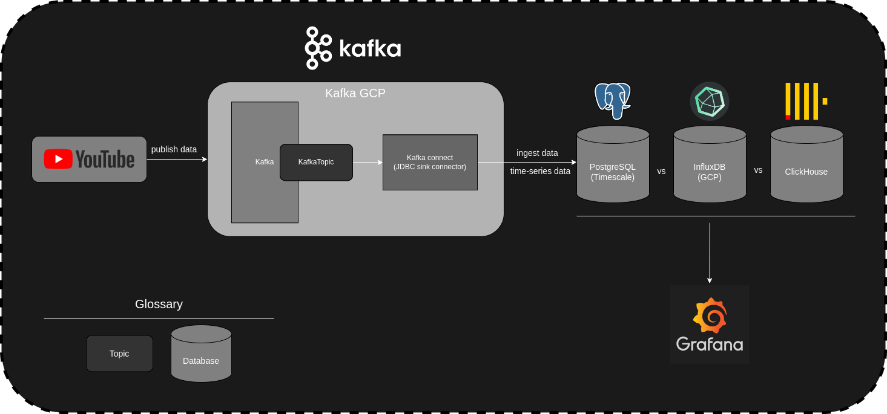

&nbsp;
# BD Streaming Project
## Pre-installation
- Python 3 (latest version): `https://www.python.org/downloads/`
- virtualenv (Package): `pip install virtualenv`
- Docker (latest version): `https://docs.docker.com/get-docker/`
- Docker Compose (if needed): `https://docs.docker.com/compose/install/linux`  
- DBeaver (latest version): `https://dbeaver.io/download/`

## Overall Structure
<p align="center" width="100%">
    
</p>


## 1. Create virtual env
- Run in terminal of current path: 
```virtualenv .venv```
- Enable virtual environment:
```source .venv/bin/activate```
- Install requirements: 
```pip install -r requirements.txt```

## 2. Build kafka container
- Run in terminal of current path: ```docker-compose up -d```

## 3. Check container running
- ```docker ps -a```
(if any container does not run, try: ```docker-compose up -d``` again)

## 4. Config Kafka Control Center

- Step 1: Access to Kafka control center: 

  - http://localhost:9021

- Step 2: Access to Timescaledb using `DBeaver`:
  - Choose `Postgres`
  - Host: localhost
  - Port: 5434
  - Database: postgres
  - User name: {username}
  - Password: {password}
  - Right click to `public schemas` -> SQL editor -> Open SQL Script -> Run this SQL script: 

```sql
CREATE TABLE stream_yt (
  "type" varchar,
  comment_at timestamp NOT NULL,
  user_name varchar NOT null,
  cmt varchar
); 
```
then
```sql
SELECT create_hypertable('stream_yt', 'comment_at');
```

- Step 3: Run in the terminal of current path ```python producers.py``` to auto generate topic and run the producer 

- Step 4: Click `Connect` tab -> Click `connect-default` -> Add connector -> Click `Upload connector config file` -> upload `connector_JdbcSinkConnectorConnector_0_config.json` -> Click `Next` -> Click `Launch` -> Open table `stream_yt` for following

## 7. Access to Grafana
http://localhost:3000

Login Account:
- username: admin
- password: foobar

In the bottom left panel -> Choose `Data sources` -> Click `Add data source` -> search postgres 
- Host: timescaledb:5432
- Database: postgres
- User: {username}
- Password: {password}
- TLS/SSL Mode: disable
-> Click `Save & test` -> Click `Explore`
in the upper left panel -> Choose `Dashboards` -> Click `new dashboards` -> Click `add a new panel` -> Switch `Builder` to `Code` toggle -> Input SQL query

## Clean Up
- Run in terminal of current path: 
  - `docker-compose down` to temporary stop the containers
  - `docker-compose rm` to removes stopped service containers
